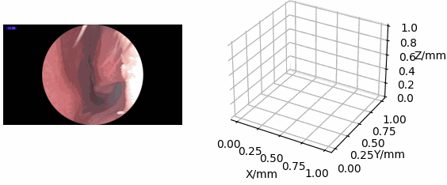
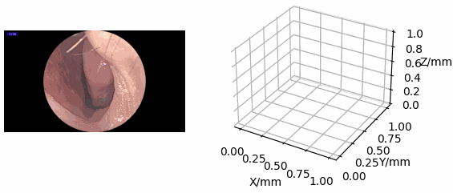
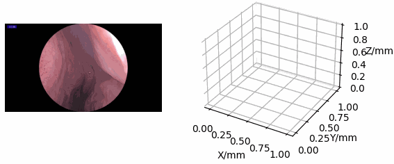
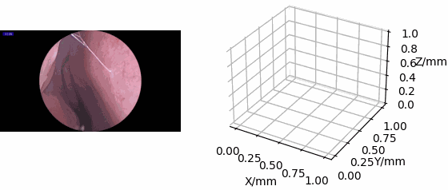
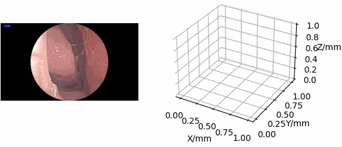
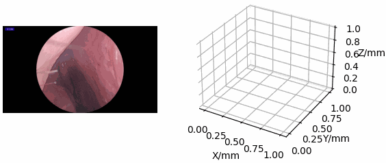

  
---
  
<var>
<h2> NEPose: A Novel Benchmark Dataset with An Improved Framework for Vision-based Nasal Endoscope Pose Estimation </h2>
<h4> <a href='https://baymax-shao.netlify.app/'>Liangjing Shao</a>1,2, Benshuang Chen1, Yawen Liu1, Xinrong Chen1,2 </h4>
<h5> 1Fudan University  2Shanghai Key Laboratory of MICCAI</h5>
<h3> <a href='https://www.sciencedirect.com/science/article/pii/S0031320325013871'>Pattern Recognition 2025</a> </h3>
</var> 
  
---

You can access the dataset by _contacting the corresponding author of our paper via email_.

Here are **some examples** of the data.

